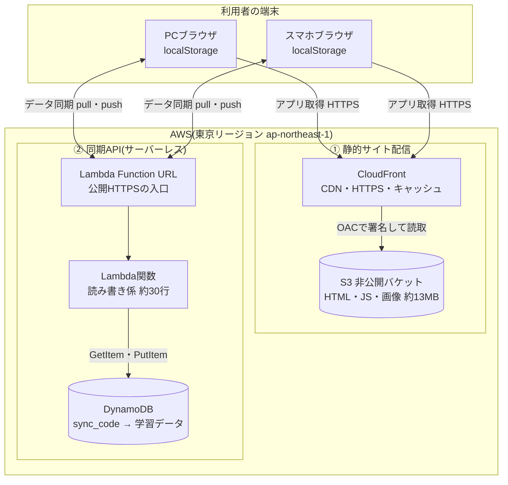
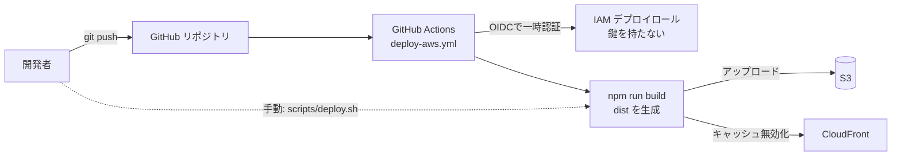

# ap-study AWS 構成図

AWS上に構築した ap-study(応用情報 学習アプリ)の全体構成。個人利用・無料枠前提。
GitHubで開くと下のMermaid図が図として描画されます。詳細は各ドキュメント参照:
[費用試算](./aws-cost-estimate.md) / [構築計画](./aws-build-plan.md) / [同期のしくみ](./sync-architecture.md) / [構築手順](../infra/README.md)。

---

## 1. 全体構成図(配信 + 同期)

利用者から見た2つの経路 —— アプリを「届ける」配信経路と、学習データを「やり取りする」同期経路。

- **配信経路(①)**: `ブラウザ → CloudFront → (OAC) → S3`。S3は非公開で、CloudFront経由でのみ配信。
- **同期経路(②)**: `ブラウザ → Lambda Function URL → Lambda → DynamoDB`。同期のときだけ動くサーバーレス。
- 進捗は各端末の **localStorage** が主。②は端末間で揃えたいときだけ使う。

## 2. デプロイの流れ

コード変更をS3へ反映し、CloudFrontのキャッシュを無効化する経路。手動と自動(CI)の2通り。

- **手動**: 手元で `scripts/deploy.sh`(ビルド→S3同期→無効化)
- **自動(任意)**: `main` へ push すると GitHub Actions が OIDC でロールを一時取得してデプロイ(現状は手動起動のみ・任意で有効化)

## 3. 構成要素の一覧

| 分類 | サービス / リソース | 役割 | 定義ファイル |
|---|---|---|---|
| 配信 | **S3** | 静的ファイル(約13MB)の非公開の置き場 | `infra/hosting.yaml` |
| 配信 | **CloudFront** | CDN・HTTPS化・圧縮・キャッシュ | `infra/hosting.yaml` |
| 配信 | **OAC** | CloudFrontだけがS3を読めるようにする署名 | `infra/hosting.yaml` |
| 同期 | **Lambda Function URL** | 公開HTTPSの入口(API Gateway不要) | `infra/sync.yaml` |
| 同期 | **Lambda関数** | 同期コードで読み書きする処理(約30行) | `infra/sync.yaml` |
| 同期 | **DynamoDB** | sync_code をキーに学習データを保管 | `infra/sync.yaml` |
| 権限 | **IAM: Lambda実行ロール** | LambdaがDynamoDBを読み書きする最小権限 | `infra/sync.yaml` |
| 権限 | **IAM: OIDCデプロイロール** | GitHub Actionsが鍵レスでデプロイする権限 | `infra/github-oidc.yaml` |
| 監視 | **AWS Budgets** | 月$1超で通知(異常課金の早期検知) | 手動作成(`infra/README.md`) |
| 監視 | **CloudWatch Logs** | Lambdaの実行ログ(自動) | Lambda標準 |
| CI | **GitHub Actions** | push→自動ビルド&デプロイ(任意) | `.github/workflows/deploy-aws.yml` |

## 4. セキュリティのポイント

- **S3は完全非公開**。パブリックアクセスは全ブロックし、CloudFrontのOAC経由でのみ読取。
- **同期APIは公開だが認証なしの割り切り**(同期コード方式)。CORSは配信元オリジンに限定。
- **最小権限**: Lambda実行ロールは DynamoDB の GetItem/PutItem のみ。デプロイロールは対象バケット/ディストリビューションのみ。
- **鍵レスCI**: GitHub Actions は長期アクセスキーを持たず、OIDCで一時認証。

## 5. コスト構造(個人利用で実質0円)

| サービス | 無料枠 | 個人利用の消費 |
|---|---|---|
| CloudFront | 常時無料 1TB/月・1,000万req | 遥かに下回る → 0円 |
| S3 | ストレージ従量 | 13MB ≒ 月$0.0003 |
| Lambda | 常時無料 100万req/月 | 数百req → 0円 |
| DynamoDB | オンデマンド + 保存25GB無料 | 数KB・少回数 → 実質0円 |
| Route 53(未使用) | なし | 独自ドメイン時のみ $0.5/月 |

サーバーを常時起動しない**サーバーレス + 静的配信**構成のため、待機コストが出ず、無料枠内で運用できる。
