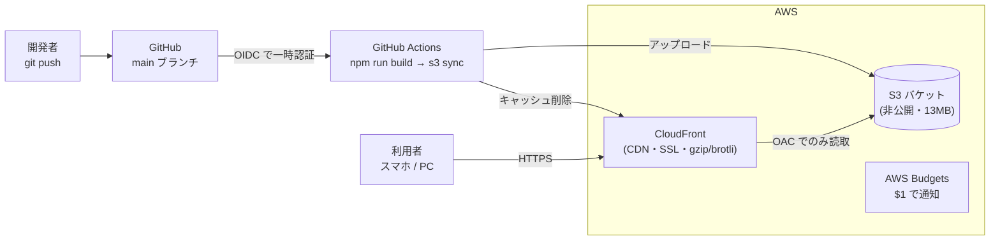

# AWS 構築計画書 — S3 + CloudFront(個人利用)

ap-study を **S3 + CloudFront** で配信するための構築計画書。コスト試算は [aws-cost-estimate.md](./aws-cost-estimate.md) を参照(結論: **独自ドメインなしなら実質 0 円/月**)。

- 対象: 静的 SPA(`npm run build` の `dist/` 約 13MB)を配信するだけ。サーバー/DB は不要
- 方針: **常時無料枠に収める** / **S3 は非公開・CloudFront 経由のみ** / **鍵を持たない CI(OIDC)**
- 作成日: 2026-07-20

---

## 1. 目的とスコープ

| 項目 | 内容 |
|---|---|
| 目的 | 学習アプリを HTTPS で安定配信し、`git push` で自動デプロイできる状態にする |
| 対象範囲 | S3(オリジン)、CloudFront(CDN/HTTPS)、GitHub Actions(CI/CD)、AWS Budgets(予算監視)、(任意)Route 53 + ACM(独自ドメイン) |
| 対象外 | クラウド同期のバックエンド(当面 Supabase 無料枠を継続。AWS 化は別途 [aws-cost-estimate.md] 案C) / AI チャット(BYOK のためサーバー不要) |
| 前提 | 利用者は自分+身近な数人、非公開(要件書 1章)。トラフィックは月 1〜5GB 程度で無料枠に十分収まる |

---

## 2. 全体アーキテクチャ



**設計上のポイント**

- **HashRouter 採用**(`src/App.tsx` で確認)。ルーティングは `#` 以降のクライアント側処理で完結するため、**CloudFront の SPA フォールバック(403/404 → index.html)設定は不要**。`default root object = index.html` だけでよい
- **S3 は「ウェブサイトホスティング」機能を使わない**。CloudFront の **OAC(Origin Access Control)** から REST エンドポイント経由で読ませ、S3 バケットは**完全非公開**にする(直リンク流入・意図しない公開を防止)
- **CI は OIDC**でロールを一時取得。長期の AWS アクセスキーを GitHub に置かない

---

## 3. 構築するリソース一覧

| # | サービス | リソース | 主要設定 | 無料枠 |
|---|---|---|---|---|
| 1 | S3 | 配信用バケット `ap-study-web-<任意>` | リージョン ap-northeast-1(東京)/ パブリックアクセスブロック **全ON** / バージョニング OFF | 保存 13MB ≒ 月 $0.0003 |
| 2 | CloudFront | ディストリビューション | オリジン=①(OAC)/ デフォルトルート `index.html` / HTTP→HTTPS リダイレクト / 圧縮 ON / PriceClass_200(日本エッジ含む) | 常時無料枠 1TB・1,000万req 内 |
| 3 | S3 | バケットポリシー | CloudFront サービスプリンシパル + 対象ディストリビューション ARN のみ許可 | — |
| 4 | IAM | OIDC プロバイダ + デプロイ用ロール | `token.actions.githubusercontent.com` を信頼 / 対象リポジトリに限定 | 無料 |
| 5 | GitHub | Actions ワークフロー + Secrets | build → s3 sync → invalidation | Actions は公開/個人枠内 |
| 6 | AWS Budgets | 予算アラート | 月 $1 超でメール通知 | 2 予算まで無料 |
| 7(任意) | ACM | SSL 証明書 | **us-east-1 で発行**(CloudFront 要件)/ DNS 検証 | 無料 |
| 8(任意) | Route 53 | ホストゾーン + A(ALIAS)レコード | CloudFront を指す ALIAS | ゾーン $0.50/月 |

---

## 4. 事前準備(前提条件)

- [ ] AWS アカウント(2026 年時点の新規は「無料プラン=$200 クレジット/6ヶ月」。常時無料枠は継続利用可)
- [ ] AWS CLI v2 インストール & `aws configure`(または SSO)で認証
- [ ] Node.js(このリポジトリがビルドできる環境)
- [ ] GitHub リポジトリの管理権限(Secrets / OIDC 設定のため)
- [ ] (任意)独自ドメイン。使う場合のみフェーズ3で取得

> 以降のコマンドは `BUCKET`, `DIST_ID`, `ACCOUNT_ID` 等を自分の値に置き換えて使う。リージョンは東京(`ap-northeast-1`)を想定。

---

## 5. 構築フェーズ(段階的に進める)

MVP(フェーズ1)だけで「HTTPS で公開」は達成できる。以降は必要に応じて追加する。

| フェーズ | 内容 | 目安工数 | 必須? |
|---|---|---|---|
| **1** | S3 + CloudFront 手動構築(まず公開する) | 1〜2 時間 | ★必須 |
| **2** | GitHub Actions で自動デプロイ(OIDC) | 1〜2 時間 | 推奨 |
| **3** | 独自ドメイン(ACM + Route 53) | 30分〜1時間(+DNS 伝播待ち) | 任意 |
| **4** | コスト/セキュリティのガードレール | 30 分 | ★必須 |

---

## 6. フェーズ1: S3 + CloudFront の構築

### 6-1. S3 バケット作成(非公開)

```bash
export BUCKET=ap-study-web-<任意のユニーク文字列>
export REGION=ap-northeast-1

aws s3api create-bucket \
  --bucket "$BUCKET" \
  --region "$REGION" \
  --create-bucket-configuration LocationConstraint="$REGION"

# パブリックアクセスは全てブロック(CloudFront 経由でのみ配信するため)
aws s3api put-public-access-block \
  --bucket "$BUCKET" \
  --public-access-block-configuration \
  BlockPublicAcls=true,IgnorePublicAcls=true,BlockPublicPolicy=true,RestrictPublicBuckets=true
```

### 6-2. 初回アップロード

```bash
npm run build
aws s3 sync dist/ "s3://$BUCKET" --delete
```

### 6-3. CloudFront ディストリビューション作成(OAC 付き)

初回はマネジメントコンソールが簡単(CLI は JSON が冗長なため)。以下の設定で作成する:

1. **オリジン**: 作成した S3 バケットを選択
2. **Origin access**: 「Origin access control settings (recommended)」を選び **OAC を新規作成**
3. **Default root object**: `index.html`
4. **Viewer protocol policy**: Redirect HTTP to HTTPS
5. **Compress objects automatically**: Yes
6. **Price class**: Use North America, Europe, **Asia**(= PriceClass_200。日本のエッジを含む)
7. 作成後に表示される **「S3 バケットポリシーを更新してください」の JSON をコピー**して次の 6-4 に適用

> HashRouter のため **カスタムエラーレスポンス(403/404→index.html)は設定不要**。もし将来 BrowserRouter に変えるなら、その時だけ「403・404 を `/index.html`・ステータス 200」で返す設定を追加する。

### 6-4. S3 バケットポリシー(CloudFront だけに読取許可)

コンソールが生成する内容と同等。`ACCOUNT_ID` と `DIST_ID` を置き換える:

```json
{
  "Version": "2012-10-17",
  "Statement": [
    {
      "Sid": "AllowCloudFrontServicePrincipal",
      "Effect": "Allow",
      "Principal": { "Service": "cloudfront.amazonaws.com" },
      "Action": "s3:GetObject",
      "Resource": "arn:aws:s3:::BUCKET/*",
      "Condition": {
        "StringEquals": {
          "AWS:SourceArn": "arn:aws:cloudfront::ACCOUNT_ID:distribution/DIST_ID"
        }
      }
    }
  ]
}
```

```bash
aws s3api put-bucket-policy --bucket "$BUCKET" --policy file://bucket-policy.json
```

### 6-5. 動作確認

```bash
# 配布ドメインを確認して開く
aws cloudfront get-distribution --id "$DIST_ID" \
  --query 'Distribution.DomainName' --output text
# → https://xxxxxxxx.cloudfront.net をブラウザで開く
```

**確認項目**: トップ表示 / 演習で図表 PNG が出る / リロードしても 404 にならない(HashRouter)/ HTTP が HTTPS にリダイレクトされる。

---

## 7. キャッシュ戦略

ファイル種別ごとに `Cache-Control` を分けると、更新反映とキャッシュ効率を両立できる。

| 対象 | 特性 | Cache-Control | 更新反映 |
|---|---|---|---|
| `assets/*`(JS/CSS) | **ファイル名にハッシュ**(`index-C2H6tnR8.js`) | `public,max-age=31536000,immutable` | 名前が変わるので自然に更新 |
| `figures/*`(PNG) | 名前固定・変更頻度低 | `public,max-age=86400`(1日) | デプロイ時の invalidation で反映 |
| `index.html` | 常に最新を配りたい | `no-cache`(毎回検証) | 即時反映 |

sync で種別ごとにヘッダを付与する例(フェーズ2のワークフローにも組み込む):

```bash
# 1) ハッシュ付き資産 = 長期 immutable(index.html は除外)
aws s3 sync dist/ "s3://$BUCKET" --delete \
  --exclude "index.html" \
  --cache-control "public,max-age=31536000,immutable"

# 2) 図表だけ 1 日キャッシュに上書き
aws s3 cp dist/figures "s3://$BUCKET/figures" --recursive \
  --cache-control "public,max-age=86400" \
  --metadata-directive REPLACE

# 3) index.html は no-cache
aws s3 cp dist/index.html "s3://$BUCKET/index.html" \
  --cache-control "no-cache" --content-type "text/html"
```

> CloudFront の invalidation は月 **1,000 パスまで無料**。デプロイ毎に `"/*"`(1 パス扱い)を流せば実質無料で全反映できる。

---

## 8. フェーズ2: GitHub Actions で自動デプロイ(OIDC)

`main` に push すると自動でビルド&デプロイする。**アクセスキーを持たせず OIDC で一時認証**する。

### 8-1. IAM 側(1回だけ)

1. **OIDC プロバイダ**を作成: プロバイダ URL `https://token.actions.githubusercontent.com` / 対象 `sts.amazonaws.com`
2. **デプロイ用 IAM ロール**を作成し、信頼ポリシーを対象リポジトリに限定:

```json
{
  "Version": "2012-10-17",
  "Statement": [{
    "Effect": "Allow",
    "Principal": { "Federated": "arn:aws:iam::ACCOUNT_ID:oidc-provider/token.actions.githubusercontent.com" },
    "Action": "sts:AssumeRoleWithWebIdentity",
    "Condition": {
      "StringEquals": { "token.actions.githubusercontent.com:aud": "sts.amazonaws.com" },
      "StringLike": { "token.actions.githubusercontent.com:sub": "repo:westplainblue/ap-study:ref:refs/heads/main" }
    }
  }]
}
```

3. ロールに付ける権限(最小権限):

```json
{
  "Version": "2012-10-17",
  "Statement": [
    { "Effect": "Allow", "Action": ["s3:PutObject","s3:DeleteObject","s3:ListBucket"],
      "Resource": ["arn:aws:s3:::BUCKET","arn:aws:s3:::BUCKET/*"] },
    { "Effect": "Allow", "Action": ["cloudfront:CreateInvalidation"],
      "Resource": "arn:aws:cloudfront::ACCOUNT_ID:distribution/DIST_ID" }
  ]
}
```

### 8-2. GitHub 側の Secrets(または Variables)

| 名前 | 用途 |
|---|---|
| `AWS_DEPLOY_ROLE_ARN` | 上で作ったロールの ARN |
| `S3_BUCKET` | バケット名 |
| `CF_DISTRIBUTION_ID` | ディストリビューション ID |
| `VITE_SUPABASE_URL` / `VITE_SUPABASE_ANON_KEY` | クラウド同期を使う場合のビルド時変数(未設定でもアプリは動作) |

> 補足: anon キーは設計上クライアントに埋め込まれる公開前提のキー(README 参照)。Secrets 管理は「リポジトリに平文コミットしない」目的。

### 8-3. ワークフロー(`.github/workflows/deploy.yml`)

```yaml
name: Deploy to S3 + CloudFront
on:
  push:
    branches: [main]
permissions:
  id-token: write   # OIDC に必須
  contents: read
jobs:
  deploy:
    runs-on: ubuntu-latest
    steps:
      - uses: actions/checkout@v4
      - uses: actions/setup-node@v4
        with: { node-version: 20, cache: npm }
      - run: npm ci
      - run: npm run build
        env:
          VITE_SUPABASE_URL: ${{ secrets.VITE_SUPABASE_URL }}
          VITE_SUPABASE_ANON_KEY: ${{ secrets.VITE_SUPABASE_ANON_KEY }}
      - uses: aws-actions/configure-aws-credentials@v4
        with:
          role-to-assume: ${{ secrets.AWS_DEPLOY_ROLE_ARN }}
          aws-region: ap-northeast-1
      - name: Sync to S3
        run: |
          aws s3 sync dist/ "s3://${{ secrets.S3_BUCKET }}" --delete \
            --exclude "index.html" --cache-control "public,max-age=31536000,immutable"
          aws s3 cp dist/figures "s3://${{ secrets.S3_BUCKET }}/figures" --recursive \
            --cache-control "public,max-age=86400" --metadata-directive REPLACE
          aws s3 cp dist/index.html "s3://${{ secrets.S3_BUCKET }}/index.html" \
            --cache-control "no-cache" --content-type "text/html"
      - name: Invalidate CloudFront
        run: |
          aws cloudfront create-invalidation \
            --distribution-id "${{ secrets.CF_DISTRIBUTION_ID }}" --paths "/*"
```

> このワークフローファイルは本計画書には含めていない(計画段階のため)。実装フェーズで作成する。

---

## 9. フェーズ3: 独自ドメイン(任意)

`cloudfront.net` のままでよければスキップ可(**追加コスト 0**)。使う場合:

1. **ACM 証明書を us-east-1(バージニア北部)で発行**(CloudFront はグローバルだが証明書は必ず us-east-1)。DNS 検証を選ぶ
2. Route 53 にホストゾーンを作成($0.50/月)、ACM が要求する CNAME を追加して検証完了
3. CloudFront の **Alternate domain name (CNAME)** に独自ドメインを設定し、発行済み証明書を紐付け
4. Route 53 に **A レコード(ALIAS)** を作成し、CloudFront ディストリビューションを指す

> 追加コスト目安: Route 53 ゾーン $0.50/月 + ドメイン登録料(.com 年 $12〜15)= **約 200円/月**。

---

## 10. フェーズ4: コスト/セキュリティのガードレール(必須)

- [ ] **AWS Budgets** を作成(月 $1 でメール通知)。想定外課金の早期検知:
  ```bash
  aws budgets create-budget --account-id ACCOUNT_ID \
    --budget '{"BudgetName":"ap-study-monthly","BudgetLimit":{"Amount":"1","Unit":"USD"},"TimeUnit":"MONTHLY","BudgetType":"COST"}' \
    --notifications-with-subscribers '[{"Notification":{"NotificationType":"ACTUAL","ComparisonOperator":"GREATER_THAN","Threshold":80},"Subscribers":[{"SubscriptionType":"EMAIL","Address":"you@example.com"}]}]'
  ```
- [ ] S3 のパブリックアクセスブロックが**全 ON**であること(6-1 で設定済み)
- [ ] バケットポリシーが **CloudFront の該当ディストリビューションのみ**許可(ワイルドカードや `Principal:*` にしない)
- [ ] S3 **バージョニング/アクセスログは OFF**(不要な容量課金を避ける)
- [ ] IAM デプロイロールは**対象リポジトリ・対象ブランチに限定**(8-1 の `sub` 条件)

---

## 11. 平常運用(デプロイ / ロールバック)

- **通常デプロイ**: `main` に push → GitHub Actions が自動実行(フェーズ2 導入後)
- **手動デプロイ**: 手元で `npm run build` → 7章の sync 3 コマンド → invalidation
- **ロールバック**: 直前のコミットに戻して再 push(静的サイトなので確実)。厳密な即時復旧が要るなら S3 バージョニングを有効化する手もあるが、個人利用では Git 履歴で十分
- **データ追加(過去問)**: README「過去問の追加手順」で `dist/` を再生成 → 通常デプロイに乗る。図表が増えても無料枠内

---

## 12. 完了チェックリスト

**フェーズ1(公開)**
- [ ] S3 バケット作成・パブリックアクセス全ブロック
- [ ] `dist/` を sync 済み
- [ ] CloudFront 作成(OAC / default root object=index.html / HTTPS リダイレクト / 圧縮 ON / PriceClass_200)
- [ ] バケットポリシーを CloudFront 限定で適用
- [ ] `xxxx.cloudfront.net` で表示・図表・リロードを確認

**フェーズ2(CI/CD)**
- [ ] IAM OIDC プロバイダ + デプロイロール(リポジトリ限定)
- [ ] GitHub Secrets 登録
- [ ] `deploy.yml` を追加し、push で自動デプロイを確認

**フェーズ4(ガードレール)**
- [ ] AWS Budgets($1)通知
- [ ] セキュリティ設定の再確認(S3 非公開 / ポリシー最小 / ロール限定)

**フェーズ3(任意)**
- [ ] ACM(us-east-1)発行・検証
- [ ] Route 53 ゾーン + ALIAS、CloudFront に CNAME 紐付け

---

## 13. 想定コスト(再掲)

| 構成 | 月額 |
|---|---|
| フェーズ1〜2 + 4(cloudfront.net ドメイン) | **実質 0 円**(常時無料枠内) |
| + フェーズ3(独自ドメイン) | **約 200円/月**(Route 53 + ドメイン登録料) |

詳細は [aws-cost-estimate.md](./aws-cost-estimate.md)。

---

## 14. 次アクション(このリポジトリでの実装物)

この計画に沿って、必要になれば以下を実装物として追加できる:

1. `.github/workflows/deploy.yml`(フェーズ2 のワークフロー)
2. `infra/`(CloudFormation / Terraform)で S3・CloudFront・OAC・IAM をコード化(再現性・一発構築)
3. `scripts/deploy.sh`(手動デプロイ用のワンショットスクリプト)

> まずはフェーズ1 を手動で通し、動作確認後に 2 以降を自動化する進め方を推奨する。
