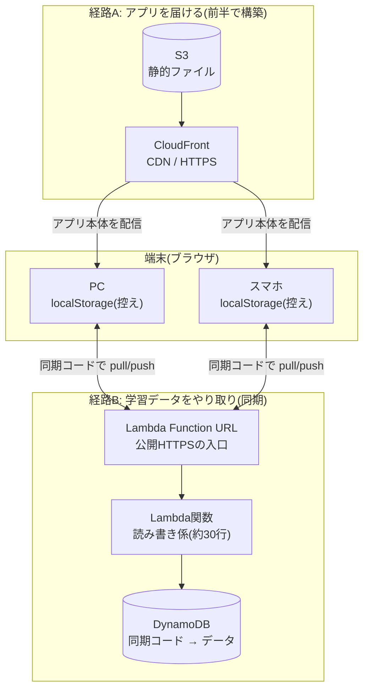
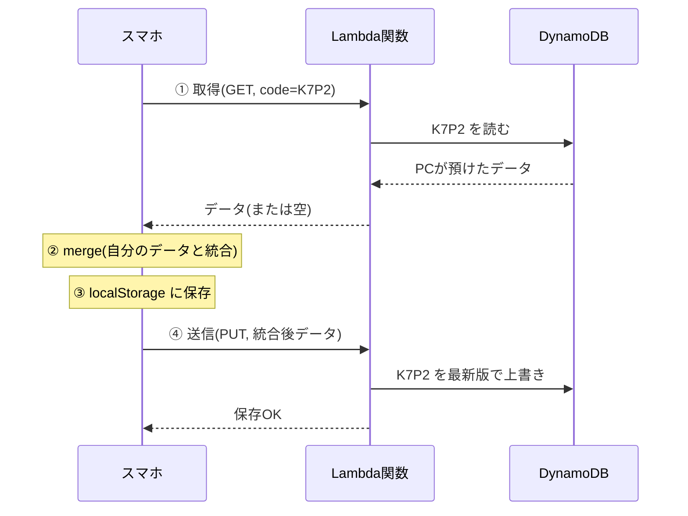

# クラウド同期のしくみ(AWS: Lambda + DynamoDB)

ap-study の端末間同期(PC↔スマホ等)がどう動いているかの解説。初学者向け。
関連コード: [`infra/sync.yaml`](../infra/sync.yaml)(インフラ)/ [`src/lib/sync.ts`](../src/lib/sync.ts)(アプリ側)。

---

## 1. 一言でいうと

> **「同期コード」という合言葉をキーに、各端末が"クラウドの保管庫"に学習データを預けたり取り出したりして、全端末を同じ内容に揃える仕組み。**

たとえるなら **番号付きの共有ロッカー**。PCもスマホも同じ番号(同期コード)のロッカーを使い、「自分のノートをロッカーの内容と突き合わせて最新版を作り、ロッカーにも戻す」ことで両方が同じ内容になる。

## 2. 全体像:役割の違う2つの経路

このアプリには通信経路が2つあり、役割が異なる。ここを分けて理解するのが重要。

- **経路A(配信)**: アプリの本体(HTML/JS/画像)を届ける。`S3 → CloudFront → ブラウザ`
- **経路B(同期)**: 学習データを保存・取得する。同期のときだけ動く。`ブラウザ ⇄ Lambda URL ⇄ Lambda ⇄ DynamoDB`

## 3. 登場人物と役割

| 登場人物 | 役割 | たとえ |
|---|---|---|
| **localStorage** | 各ブラウザ内のデータ保管。**端末ごとに独立** | 手元の個人ノート |
| **同期コード** | どのデータ同士を揃えるかの合言葉(キー) | 共有ロッカーの番号 |
| **Lambda Function URL** | インターネットからLambdaを呼べる公開の入口(HTTPS) | ロッカー室の受付窓口 |
| **Lambda関数** | 「取得」「保存」を処理する係。データベースを読み書きする | 受付の係員 |
| **DynamoDB** | 同期コードをキーに学習データ(JSON)を保管するNoSQL DB | 番号付きロッカーの棚 |

**localStorageは端末ごとに別物**。だから同期しないとPCとスマホは別々のまま。これが「連携されていない」状態の正体。

## 4. 「今すぐ同期」を押した瞬間の流れ(pull → merge → 保存 → push)

アプリの `syncNow()`([`src/lib/sync.ts`](../src/lib/sync.ts))が次の順で動く。スマホで押した例:

これでスマホもクラウドも「PC+スマホの合体版」になる。次にPCで同期すれば、PCもその合体版を取得して全員が一致する。

## 5. なぜ2台が「同じ」に揃うのか(マージのしくみ)

単純な上書きだと後勝ちで前のデータが消える。それを防ぐのが `mergeStates`([`src/lib/progress.ts`](../src/lib/progress.ts))。賢い合わせ方をしている:

- **解答履歴(どの問題をいつ正誤したか)** → **両端末を合体(重複は除く)**。どちらの記録も消えない(union)
- **復習状況・設定・午後の採点** → **より新しく更新した端末の値を優先**しつつ、片方にしか無いものは残す
- 全体の更新時刻は新しい方を採用

だから「PCで解いた10問」と「スマホで解いた5問」を同期すると **両方の15問** が揃う。両端末で同期を押せば、確実に同じ状態へ**収束**する。

## 6. セキュリティ・権限のしくみ

公開の入口を安全に開けるため、AWSは複数のチェックをかける(構築時にここでつまずいた=良い学び):

| 仕組み | 役割 | 設定 |
|---|---|---|
| **AuthType: NONE** | この入口はAWS認証なしで誰でも呼べる、という宣言 | 公開同期のため NONE |
| **リソースポリシー(2つの許可)** | 「誰がこの関数を呼んでよいか」の許可 | `InvokeFunctionUrl` + `InvokeFunction` の**両方**(2025年10月の新仕様) |
| **実行ロール(IAM Role)** | Lambda自身が**DynamoDBを読み書き**する権限 | GetItem / PutItem のみ(最小権限) |
| **CORS(AllowOrigin)** | ブラウザの安全機構。**自サイトからの呼び出しだけ許可** | 配信元の CloudFront URL に限定 |

「入口の鍵(認可)」と「係員の権限(実行ロール)」が**別管理**なのがAWSの特徴。`403 Forbidden` は前者の鍵が1本(`InvokeFunction`)足りなかった出来事だった。

> 参考: 2025年10月以降に作成する Function URL は、公開アクセスに `lambda:InvokeFunctionUrl` と `lambda:InvokeFunction` の両方が必要。
> [Control access to Lambda function URLs](https://docs.aws.amazon.com/lambda/latest/dg/urls-auth.html)

## 7. なぜ、ほぼ0円なのか

- **Lambda**: 呼ばれた時だけ課金。無料枠が**月100万リクエスト**。個人利用は月数百回程度 → **0円**
- **DynamoDB**: オンデマンド課金(固定費なし)+ 保存25GB無料枠。学習データは数KB → **実質0円**
- **Function URL**: 追加料金なし
- **予算アラート($1)** 設定済みで、異常課金もすぐ検知できる

サーバーを24時間立てる方式(EC2など)と違い、**「使った瞬間だけ動く」サーバーレス**なので待機コストがゼロ。

## 8. 関連ファイル

| ファイル | 役割 |
|---|---|
| [`infra/sync.yaml`](../infra/sync.yaml) | DynamoDB + Lambda + Function URL + IAM(CloudFormation) |
| [`src/lib/sync.ts`](../src/lib/sync.ts) | pull→merge→保存→push を行うクライアント側実装 |
| [`src/lib/progress.ts`](../src/lib/progress.ts) | localStorage 読み書きと `mergeStates`(統合ロジック) |
| [`infra/README.md`](../infra/README.md) | 構築手順(手順5がクラウド同期) |

## 9. 用語集

- **サーバーレス**: サーバーの起動・管理をせず、コードが呼ばれた時だけ実行される方式。待機コストが出ない。
- **Lambda**: AWSのサーバーレス実行環境。関数コードを置いておくと、呼ばれた時だけ動く。
- **Function URL**: Lambda関数に直接HTTPSの入口を付ける機能(API Gateway不要)。
- **DynamoDB**: AWSのフルマネージドNoSQLデータベース。キー(今回は `sync_code`)で高速に読み書きする。
- **localStorage**: ブラウザ内にデータを保存する仕組み。端末・ブラウザごとに独立。
- **CORS**: 別オリジンへのブラウザからのアクセスを制御する安全機構。サーバーが許可したオリジンだけがJSから利用可。
- **IAMロール / リソースポリシー**: 「誰が何をしてよいか」を定義するAWSの権限管理。ロールは"実行者の権限"、リソースポリシーは"資源側が誰を許すか"。
- **オンデマンド課金**: 使った回数・量だけ課金される方式(固定費なし)。

## 10. まとめ

1. 各端末は自分の **localStorage** にデータを持つ(だけだと別々)
2. **同期コード**を合言葉に、**Lambda→DynamoDB**の"共有ロッカー"を介してやり取り
3. 「今すぐ同期」で **取得→統合→保存→送信**。統合で**両端末のデータが合体**するので消えない
4. 公開の入口は **AuthType NONE + 2つの許可 + CORS** で成立
5. **サーバーレス**なので動いた分だけ=ほぼ0円

「静的サイト配信(S3+CloudFront)」+「サーバーレスAPI+DB(Lambda+DynamoDB)」という、モダンWebアプリの2大パターンを両方構築した構成。
