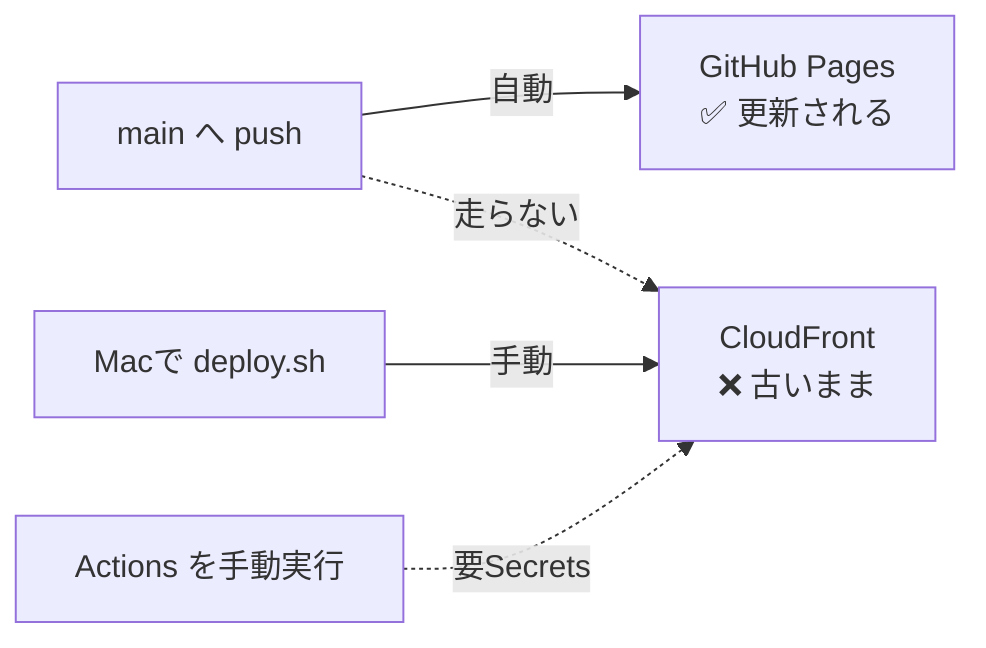

# 🚀 デプロイと公開先

[[ホーム]] に戻る

> [!warning] 最重要
> **公開先が2つあり、自動で更新されるのは片方だけです。**
> 「変更したのにページに反映されない」の原因はほぼこれです。

---

## 2つの公開先

| 公開先 | 更新方法 | ワークフロー |
|---|---|---|
| **GitHub Pages** | `main` へpushすると**自動** | `.github/workflows/deploy.yml` |
| **AWS(S3 + CloudFront)** | **手動のみ** | `.github/workflows/deploy-aws.yml`(pushトリガーは無効) |



---

## AWSへ手動デプロイ(Macで)

```bash
git pull origin main
HOSTING_STACK=ap-study-hosting ./scripts/deploy.sh
```

スクリプトがやること: ビルド → S3同期(キャッシュ戦略3段階)→ CloudFront無効化。
`index.html` は `no-cache`、ハッシュ付きアセットは長期キャッシュです。

---

## 反映されないときの切り分け

1. **コミットは main に入っているか** — `git log --oneline -3 origin/main`
2. **どちらのURLを見ているか**
   - `*.github.io` → 自動デプロイ済みのはず。Actionsの成功を確認して**スーパーリロード**(`⌘+Shift+R`)
   - `*.cloudfront.net` / 独自ドメイン → **手動デプロイが必要**(上記コマンド)
3. **Actionsの結果** — GitHubの Actions タブ、または該当コミットのチェックマーク
4. それでも古い → ブラウザのキャッシュ削除、シークレットウィンドウで確認

---

## AWSも自動化したい場合

`deploy-aws.yml` の以下2行のコメントを外すだけです。

```yaml
on:
  workflow_dispatch:
  # push:
  #   branches: [main]
```

ただし GitHub Secrets に次の3つが必要です(OIDC方式なので長期アクセスキーは不要):

- `AWS_DEPLOY_ROLE_ARN` — `infra/github-oidc.yaml` の出力
- `S3_BUCKET` / `CF_DISTRIBUTION_ID` — `infra/hosting.yaml` の出力

---

## デプロイ後にやること

> [!important] 古いタブのリロード
> 同期の規則を変更したリリースの後は、**開きっぱなしのスマホ/PCのタブを一度リロード**
> してください。旧コードのマージ規則で書き戻されるのを防ぐためです(→ [[同期とマージ規則]])。

- Codexブリッジを使っている場合は、ブリッジ側の変更があれば再起動
- 問題データを追加した場合は、演習の試験回チップ・模試の一覧に新しい回が出るか確認

関連: [[architecture|AWS構成図]] / [[aws-build-plan|AWS構築計画書]] / [[aws-cost-estimate|コスト試算]] / [[トラブルシューティング]]
