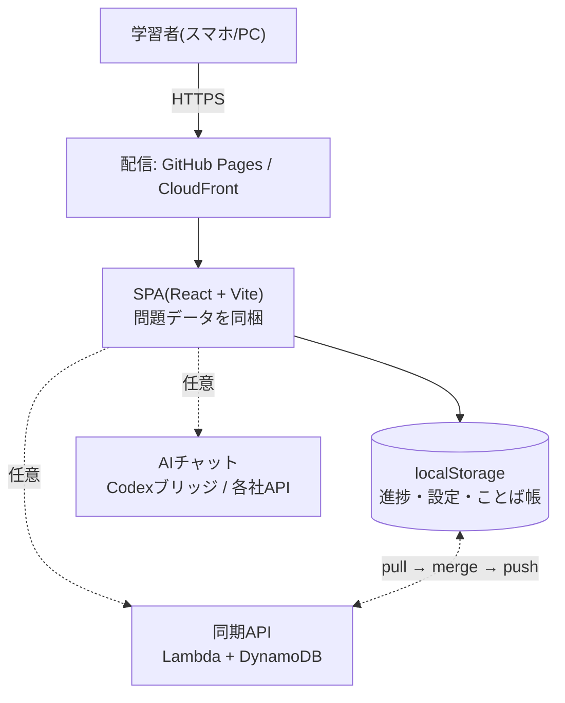

# 🏠 AP Study ドキュメント

> [!info] このVaultについて
> 応用情報技術者試験の学習Webアプリ **AP Study** の開発ドキュメントです。
> このフォルダ(`docs/`)がObsidianのVaultになっています。
> Obsidianで「フォルダをVaultとして開く」→ `ap-study/docs` を選んでください。

**AP Study とは**: IPA公開の過去問(午前880問・午後40問)を収録した、スマホ/PCで動く学習アプリ。
サーバーを持たず、進捗は端末内(localStorage)に保存。任意でクラウド同期とAIチャットを使えます。

---

## 🚪 目的から探す

| やりたいこと | 見るノート |
|---|---|
| アプリに何ができるか知りたい | [[機能マップ]] |
| 開発環境を用意して触りたい | [[はじめての開発]] |
| データの形・保存先を知りたい | [[データモデル]] |
| 復習や出題の仕組みを知りたい | [[学習アルゴリズム]] |
| 端末間の同期の挙動を知りたい | [[同期とマージ規則]] |
| AIチャット/採点まわりを知りたい | [[AI連携]] |
| 変更を出して本番へ反映したい | [[デプロイと公開先]] |
| テストの書き方・回し方を知りたい | [[テストと検証の作法]] |
| 動かない・反映されない | [[トラブルシューティング]] |
| 過去問データを追加したい | [[am-authoring\|午前問題の作成マニュアル]] / [[pm-authoring\|午後問題の追加手順]] |
| 「なぜこうなっているか」を知りたい | [[決定記録]] |
| 残っている不具合を知りたい | [[既知の課題]] |
| 次に何を作るか知りたい | [[ロードマップ]] |
| 用語の意味が分からない | [[用語集]] |

---

## 🗺️ 全体像

詳細は [[architecture|AWS構成図]] と [[sync-architecture|クラウド同期のしくみ]]。
図をドラッグして眺めたいときは [[アーキテクチャ.canvas|アーキテクチャ(Canvas)]] を開いてください。

---

## 📚 ノート一覧

### ガイド(手を動かす人向け)
- [[はじめての開発]] — セットアップ、npmスクリプト、ソースの歩き方、書き方の作法
- [[デプロイと公開先]] — 2つの公開先の違い(**ここを間違えると「反映されない」が起きます**)
- [[テストと検証の作法]] — ユニットテスト / 実ブラウザE2E / データ整合性チェック
- [[トラブルシューティング]] — よくある詰まりと切り分け手順

### 設計(仕組みを知る)
- [[機能マップ]] — 画面・モードの全体像と、それぞれの学習上の役割
- [[データモデル]] — 保存されるデータの全項目と、静的データの構造
- [[学習アルゴリズム]] — 間隔反復・反復学習・計算ドリル・ことば帳・選択肢シャッフルの規則
- [[同期とマージ規則]] — 端末間で衝突したときに何が勝つか
- [[AI連携]] — 4プロバイダ、Codexブリッジ、マーク機能、午後AI採点

### 記録(判断と状態)
- [[決定記録]] — 設計判断とその理由(ADR)
- [[既知の課題]] — 調査で確認済みの未修正バグ
- [[ロードマップ]] — 次に作るもの

### リファレンス
- [[用語集]] — このアプリ固有の言葉
- [[requirements|要件ブリーフ]] — 最初に決めた目的とスコープ
- [[achievements-design|実績システム設計書]] — 実績(アチーブメント)の詳細設計
- [[am-authoring|午前問題の作成マニュアル]] — 他のAIに過去問作成を依頼するときの契約書
- [[pm-authoring|午後問題の追加手順]]
- [[aws-build-plan|AWS構築計画書]] / [[aws-cost-estimate|コスト試算]]

---

## 📌 いま押さえておくべきこと

> [!warning] 公開先が2つあります
> `main` にpushすると **GitHub Pages だけ** 自動デプロイされます。
> AWS(CloudFront)側は**手動デプロイ**が必要です。詳細 → [[デプロイと公開先]]

> [!tip] 収録データ
> 午前 **11回 880問**(令和2年10月〜令和7年秋期)/ 午後 8回 40問 / 用語カード 320語 /
> 計算テーマ 15(計算問題158問を分類)

---

## 🔎 Obsidianの使い方メモ

- **グラフビュー**(左サイドバー)でノートのつながりを俯瞰できます。フォルダごとに色分け済み
- `Ctrl/Cmd + O` でノート検索、`Ctrl/Cmd + Shift + F` で全文検索
- 各ノート下部の **バックリンク** で「どこから参照されているか」が分かります
- タグ(`#設計` `#運用` など)からも辿れます

#moc
