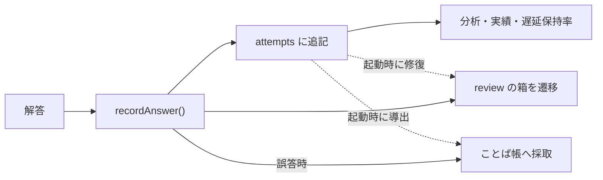

# 🗄️ データモデル

[[ホーム]] に戻る

このアプリは**サーバーを持ちません**。データは2種類だけです。

1. **静的データ**(リポジトリに同梱・全ユーザー共通) — 問題、用語カード
2. **利用者データ**(端末のlocalStorage・任意でクラウド同期) — 解答履歴、復習キュー、設定

---

## localStorage のキー一覧

| キー | 中身 | 同期 |
|---|---|---|
| `ap-study:v1` | 学習データ本体(`ProgressState`) | ✅ 対象 |
| `ap-study:ai` | AI設定・APIキー | ❌ **絶対に含めない** |
| `ap-study:ai-history` | AIチャットの入力履歴(最大50件) | ❌ |
| `ap-study:mock` | 模試の中断状態 | ❌ |
| `ap-run:<mode>` | 演習・復習の中断状態 | ❌ |
| `ap-study:ui` | 表示設定(PCサイドバーの開閉・配色) | ❌ **意図的に同期しない** |
| `ap-study:sid`(sessionStorage) | 学習セッションID | ❌ |

> [!danger] APIキーは別キーに隔離
> `ap-study:ai` を学習データと分けているのは、**クラウド同期とJSONエクスポートに
> キーが絶対に混ざらないようにするため**です。この分離は崩さないでください。

---

## ProgressState(`src/lib/progress.ts`)

```ts
interface ProgressState {
  attempts: Attempt[];                    // 解答履歴(追記専用・真実の源)
  review: Record<string, ReviewEntry>;    // 復習キュー(問題ID → 箱と期日)
  settings: Settings;                     // 設定
  pm?: PmRecords;                         // 午後の自己採点
  achievements?: Achievements;            // 実績の解除記録
  vocab?: Record<string, VocabEntry>;     // ことば帳(用語ID → 箱と期日)
  updatedAt: number;
}
```

### Attempt — 解答1回
```ts
{ q: string;   // 問題ID
  t: number;   // 解答時刻(epoch ms)
  ok: boolean;
  mode: "practice" | "review" | "drill" | "mock" | "calc";
  s?: string;  // 学習セッションID
  ms?: number; // 解答にかかった時間(計算ドリルのみ記録する任意フィールド)
  conf?: "high" | "low"; // 確信度の自己申告(任意)→ [[学習アルゴリズム#確信度メモ(自信と実際のズレ)|確信度メモ]]
}
```
**追記専用**で書き換えません。分析・実績・ことば帳・復習の修復は、すべてこの履歴から導出できます。
`ms`・`conf` は任意フィールドなので、旧クライアントとの同期でもそのまま温存されます。
`conf` だけは例外的に**直後の1タップで後付け**されます(最新の解答1件への追記で、
同一解答の重複マージでは conf を持つ側が勝ちます)。

### ReviewEntry — 復習キュー
```ts
{ box: number;  // 1〜4 = 生存(FSRS移行後は安定度から導く表示用の目安)、5 = 卒業の墓標
  due: string;  // "YYYY-MM-DD"(卒業は "9999-12-31")
  u?: number;   // このエントリの更新時刻(同期の勝敗判定に使う)
  hc?: boolean; // 自信あり誤答(思い込み)。期日到来時に最優先で出題し、次の遷移で消える
  s?: number;   // FSRS: 安定度(日)。無ければ旧Leitner形式で、次の解答時に自動移行
  d?: number;   // FSRS: 難易度 1〜10
  lr?: string;  // FSRS: 最終レビュー日
  pv?: [number, number, string] } // 直前の遷移「前」の [s, d, lr]。まぐれ申告のやり直し用
```
間隔の決め方は [[学習アルゴリズム#間隔反復(FSRS)|FSRS]] を参照。

> [!important] 卒業は「削除」ではなく「墓標」
> エントリを消すと同期で復活してしまうため、`box:5` + 遠い期日を残します。
> 理由は [[決定記録#復習の卒業を墓標にした]]、規則は [[同期とマージ規則]]。

### VocabEntry — ことば帳
```ts
{ box, due, u,
  wrongQids: string[];  // ノート入りのきっかけになった誤答問題(最大8)
  addedAt: number;
  hidden?: boolean;     // 利用者が非表示にした
  memo?: string }       // 自分メモ
```

### Settings
```ts
{ examDate?, syncCode?, shuffleChoices?,
  meta?: Record<string, number> }  // キーごとの更新時刻(削除も伝播させるため)
```

### PmPartRecord — 午後の設問1つ
```ts
{ grade?: "o"|"d"|"x"; my?: string; t: number;
  ai?: { suggested?, feedback, t } }   // AI採点の講評
```

---

## 静的データ

### 問題(`src/data/exams/*.am.json`, `*.pm.json`)
午前 **11回 880問**、午後 8回 40問。型は `src/data/types.ts`。

```ts
interface AmQuestion {
  id, examId, number, text, choices[4], answer /* 0-3 */,
  major: "T"|"M"|"S", middle /* 22分類 */,
  figure?, choicesInFigure?, explanation, point
}
```

追加手順と表記規約は [[am-authoring|午前問題の作成マニュアル]] が正本です。
登録は `src/data/index.ts` に**手動でimport追加**が必要(忘れると画面に出ません)。

### 用語カード(`src/data/terms.json` / `term-index.json`)
320語。定義はすべて**過去問からの逐語切り出し**で、生成は `scripts/build-terms.ts`。
`term-index.json` は「問題ID → その問題に出る用語ID」の索引です。
初期バンドルを膨らませないよう**動的import**で読み込みます(`src/data/terms.ts`)。

### 計算テーマ(`src/data/calc-themes.json` / `calc-index.json`)
計算ドリルの公式カード15テーマと「問題ID → テーマID」の索引。
テーマ定義(公式・解き方の型・目標秒数)は手書き、索引は `scripts/build-calc-index.ts` が
キーワード分類+`scripts/calc-theme-overrides.json` で生成します(`npm run build:calc`)。
「全計算問題がいずれかのテーマに属する」ことを生成時とテストの両方で強制しています。

### 図表(`public/figures/<examId>/am-qNN.png`)
70枚超。JSONからは `figures/...` の相対パスで参照します。

---

## データの流れ



**すべての導出は attempts から再計算できる**のが設計の芯です。
壊れた復習キューを履歴から直す修復処理(`repairReviewGraduations`)も、この性質を使っています。

関連: [[学習アルゴリズム]] / [[同期とマージ規則]] / [[機能マップ]]
