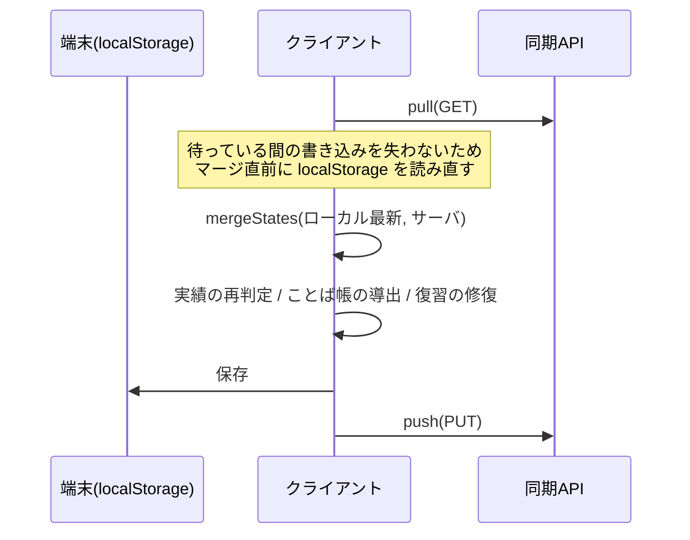

# 🔀 同期とマージ規則

[[ホーム]] に戻る

2台以上の端末で使ったとき、**どちらの値が勝つか**の規則。
インフラ側の解説は [[sync-architecture|クラウド同期のしくみ]]、ここは**マージの意味論**に絞ります。

実装は `src/lib/progress.ts` の `mergeStates()` ただ1か所です。

---

## 同期の流れ

---

## フィールドごとの規則

| データ | 規則 |
|---|---|
| 解答履歴 `attempts` | **和集合**(重複除去)。どちらの記録も消えない |
| 復習 `review` | **エントリ単位のLWW**(`u` が新しい方)。卒業は墓標 |
| ことば帳 `vocab` | エントリ単位のLWW(`u`)。導出由来は `u=0` で実操作に必ず負ける |
| 設定 `settings` | **キー単位のLWW**(`settings.meta` のキー別時刻)。**削除も伝播** |
| 午後採点 `pm` | **設問パーツ単位のLWW**(採点時刻 `t`)。AI講評は `ai.t` で独立に判定 |
| 実績 `achievements` | 統合(解除日は早い方・進捗は大きい方) |
| 未知のフィールド | **温存**(将来の追加項目を旧クライアントが落とさないための防御) |

タイムスタンプを持たない古い形式のデータは、従来どおり
「全体の更新時刻が新しい端末を優先、片方にしかないものは残す」で扱います(後方互換)。

---

## 3つの落とし穴と対策

> [!bug] ① 削除が伝わらない
> 「卒業でエントリを消す」「設定キーを消してONに戻す」は、
> 古いスナップショットとの合成で**必ず復活**します。
> **対策**: 消さずに墓標(`box:5`)を残す / 削除にもタイムスタンプを打つ。

> [!bug] ② レコード内の新しさを見ない
> 状態全体の `updatedAt` だけで勝敗を決めると、
> 「別端末で採点を直した直後に、こちらで無関係な1問を解く」だけで巻き戻ります。
> **対策**: エントリ/キー/パーツ単位のタイムスタンプで判定。

> [!bug] ③ 取得中の書き込みが消える
> 通信の往復中に記録された解答を、開始時のスナップショットで上書きしていました。
> **対策**: マージ直前に読み直す。

いずれも実際に起きていた不具合で、回帰テスト(`tests/merge.test.mjs`, `tests/sync.test.mjs`)で固定してあります。

---

## 汚染データの自動修復

過去の欠陥で「卒業したのに生き返っている」復習エントリが残る場合があります。
起動時と同期後に `repairReviewGraduations()` が走り、**解答履歴をLeitner規則でリプレイ**して
本来卒業しているエントリを墓標化します。

誤爆を防ぐ条件:
- 新方式で実操作された(`u` を持つ)エントリは触らない
- リプレイで再現できる (箱, 期日) と一致するものだけを対象にする(手動追加は触らない)
- 墓標の `u` には**卒業を確定させた解答の時刻**を使う(全端末で同じ値になり、マージが収束する)

---

## 変更するときの注意

> [!warning] リリース直後は古いタブに注意
> 旧コードを実行中のタブが同期すると、そのタブのマージ規則で書き戻されます。
> デプロイ後は**開きっぱなしの端末を一度リロード**してください。

- `ProgressState` にフィールドを足したら、`loadState()` の初期化と `mergeStates()` の規則も同時に足す
- 新フィールドは**タイムスタンプ付きのエントリ単位**にするのが既定方針
- 削除を表現したくなったら、まず墓標で表せないかを検討する

関連: [[データモデル]] / [[決定記録]] / [[トラブルシューティング]]
