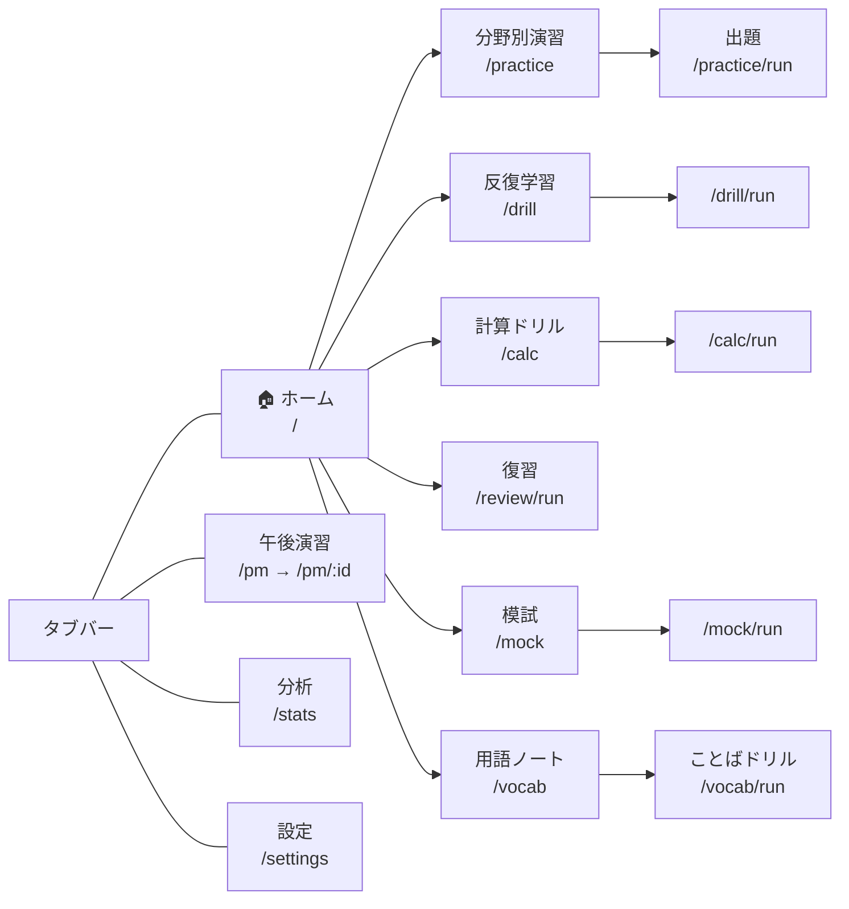

# 🧭 機能マップ

[[ホーム]] に戻る

アプリが持つ画面と学習モードの全体像。**それぞれ「何を鍛えるためにあるか」が違う**ので、
役割が重ならないように設計されています。

---

## 学習モードの役割分担

| モード | 記録名 | 鍛えるもの | 出題プール |
|---|---|---|---|
| 分野別演習 | `practice` | 初見の実力 | 分野・試験回で絞った全問 |
| 反復学習 | `drill` | その場での定着(正解するまで繰り返す) | 苦手(復習キュー)または分野 |
| 計算ドリル | `calc` | 公式の引き出しと処理速度(時間を計測) | 計算問題158問(公式テーマで絞れる) |
| 復習 | `review` | 時間をあけた後の保持 | 期日が来た問題 |
| 模試 | `mock` | 時間制約下の総合力 | 特定回の80問 |
| ことばドリル | (記録しない) | 用語の想起 | 期日が来たことば帳の語 |

> [!note] なぜ分けるのか
> 合算した正答率では「実力」と「定着度」が混ざって見えなくなるためです。
> 分析画面はモード別に出しています。詳しくは [[学習アルゴリズム]]。

---

## 画面とルート

タブバーは **ホーム / 演習 / 午後 / 分析 / 設定** の5つで埋まっています。
新機能の入口は**ホームのメニュー行**に追加するのが既定の方針です([[決定記録]] 参照)。

> [!important] PC(1024px以上)は左サイドバー
> 下部タブの代わりに `components/SideNav.tsx` を出し、**全モードを直接置いています**。
> モードを追加したら**ホームのメニュー行とサイドバーの両方**に入口が要ります。
> `[` キーかヘッダーのボタンで**アイコンのみ(64px)に畳めます**(状態は端末内保存・同期対象外)。

---

## 画面幅ごとのレイアウト

| 幅 | ナビ | 本文 |
|---|---|---|
| 〜699px | 下部タブ | 1列(AIチャットは下シート) |
| 700〜1023px | 下部タブ | 1列(AIチャットは右パネル) |
| **1024px〜** | **左サイドバー** | **読み幅720px + 2カラム** |

PCでもテキスト列は広げません(日本語は1行40〜50字が読みやすさの上限)。
余白はレイアウトに使い、CSSの部品3つで表現します。**1024px未満では素通し**なので、
モバイルの見た目は変わりません。

| クラス | 役割 |
|---|---|
| `.pc-wide` | そのページの最大幅を1180pxに広げる |
| `.pc-split` | 左右2カラム(演習の解答後、午後の長文と設問) |
| `.pc-grid-2` | 2列グリッド(ホームのメニュー、分野別の成績) |

理由と代償 → [[決定記録#PCでは本文を太らせず、余白で「横に並べる」]]

---

## 画面ごとの要点

### ホーム `src/pages/Home.tsx`
挨拶(曜日で変化)、試験日カウントダウン、**今日のプラン**、統計3枠(連続学習/累計演習/今日)、実績カード、各機能へのメニュー。

**今日のプラン**はホームの中核で、「復習(期日到来分)→ ことば(期日到来分)→
新しい問題(1日30問のノルマ)」のチェックリストです。件数は期日到来数から導出し、
終わった項目には✓が付きます。**最初の未完了タスクがそのまま主ボタン**になり
(例:「復習を始める(12問)」)、何から始めるかを考えさせません。
全部終わると完了状態(緑)になり、計算ドリル・模試を控えめに提案します。
初回起動(履歴ゼロ)ではプランの代わりに「最初の10問」への導線だけを出します。

### 分野別演習 `PracticeSetup` → `PracticeRun` → `Player`
中分類での分野選択、試験回の絞り込み、出題数(5/10/20)、計算問題の除外、
**未挑戦のみ**(まだ一度も解答していない問題だけに絞る。モード不問の全履歴で判定し、
トグルON中は分野チップの件数も未挑戦数に変わる。残数0なら開始ボタンが無効になる)。
解答回数が少ない問題を優先して出題します。
なぜ独立モードにしなかったかは [[決定記録#「未挑戦のみ」は独立モードにせず、分野別演習のオプションにした|決定記録]] 参照。

### 反復学習 `DrillSetup` → `DrillRun` → `DrillPlayer`
正解するまで同じ問題を出し直すモード。ただし**1問あたり2回まで**で打ち切り、
それ以上は次回の間隔反復にまわします(過剰学習の抑制)。
履歴に残すのは**各問の初回解答のみ**なので、他モードと同じ土俵で正答率を比較できます。

### 計算ドリル `CalcSetup` → `CalcRun` → `CalcPlayer`
計算問題158問を**公式のテーマ**(全15、稼働率・待ち行列・損益分岐点など)で束ねて特訓するモード。
「テーマ集中(同じ公式を連続=ブロック練習)」と「ごちゃまぜ(公式選択の判断込み)」を選べます。
1問ごとに解答時間を計測して目標秒数と比較し、誤答時は**公式カード**(公式+解き方の型)を必ず提示。
結果画面はテーマ別の正答率と平均時間。→ [[学習アルゴリズム#計算ドリル]]

### 復習 `ReviewRun` → `Player`
Leitner方式(1→3→7→14日)で期日が来た問題を出題。→ [[学習アルゴリズム]]

### 模試 `MockExam` → `MockRun`
80問150分、合格ライン60%。中断・再開に対応。
**解答状況の一覧**(80マス)で未解答・解答済み・見直しフラグを色分けし、クリックでその問題へ飛べます。
PCでは右に常時表示、モバイルはヘッダーのボタンで開閉。
本番の「分からない問題は飛ばして後で戻る」戦略を画面上で表せるようにするためです。
キー操作は `1`〜`4` で解答、`←``→` で移動、`F` で見直しフラグ。

### 午後演習 `PmList` → `PmDetail`
長文を折りたたみ表示し、設問ごとに自己採点(○△×)。AIによる自動採点もあり(→ [[AI連携]])。

### 用語ノート `VocabList` → `VocabRun`
間違えた問題に出てきた用語を自動収集し、過去問から逐語切り出しした定義とセットで見返せます。
4択の想起テストで間隔反復。→ [[学習アルゴリズム#ことば帳(用語のSRS)|ことば帳]]

### 分析 `Stats`
遅延保持率、日別の正答率推移、**モード別の正答率**、大分類×モード、弱点トピック、学習量、実績。

正答率の推移グラフ(`components/AccuracyTrend.tsx`)は、なぞる/タップ/キーボード(←→・Home・End・Esc)で
**その日の正答率と内訳**を吹き出しに表示します。当たり判定は点(半径2〜3px)ではなくプロット領域全体で、
X座標から最も近い日にスナップします(`lib/chart.ts` の `nearestIndex`)。

**計算テーマ別の成績**(解答実績のあるテーマのみ)では、テーマごとの正答率と
計算ドリルで測った平均解答時間を目標時間と比べて表示し、**行をタップするとそのテーマだけを特訓**できます
(`/calc/run` へテーマ集中で遷移)。

### 設定 `Settings`
試験日、**配色(端末に合わせる/ライト/ダーク)**、選択肢シャッフル、クラウド同期、
AIチャットの接続先、エクスポート/インポート。
配色は `ap-study:ui` に端末内保存し、同期しません(端末ごとに好みが違うため)。

---

## キーボードショートカット

`?` で一覧を開けます(`components/ShortcutHelp.tsx`)。実装は `lib/keys.ts` の純粋関数 +
`hooks/useAnswerKeys.ts`。**入力欄にフォーカスがある間と修飾キー付きは横取りしません**。

| キー | 動作 |
|---|---|
| `1`〜`4` / `A`〜`D` | 選択肢を選ぶ(**画面の並び順**。シャッフル時も見たまま) |
| `Enter` | 次の問題へ |
| `R` | あとで復習に登録 |
| `←` `→` / `F` | 模試: 前後の問題へ / 見直しフラグ |
| `G` → `H`/`P`/`D`/`C`/`V`/`M`/`A`/`S`/`,` | 画面移動(2ストローク。1.5秒で受付解除) |
| `[` | サイドバーの開閉(PC) |
| `?` | ショートカット一覧 |

画面移動を2ストロークにしているのは、単独キーだと**演習の解答キーと衝突する**ためです。

---

## 共通コンポーネント

| ファイル | 役割 |
|---|---|
| `components/Player.tsx` | 演習・復習の出題本体(中断/再開、シャッフル、AI連携) |
| `components/DrillPlayer.tsx` | 反復学習の出題本体(キュー制御) |
| `components/CalcPlayer.tsx` | 計算ドリルの出題本体(タイマー、公式カード、テーマ別結果) |
| `components/QuestionCard.tsx` | 問題文・選択肢・図表の描画(AIマーク対応) |
| `components/AiChat.tsx` | 右上✨のAIチャットパネル |
| `components/TabBar.tsx` | 下部タブ |

関連: [[データモデル]] / [[はじめての開発]]
